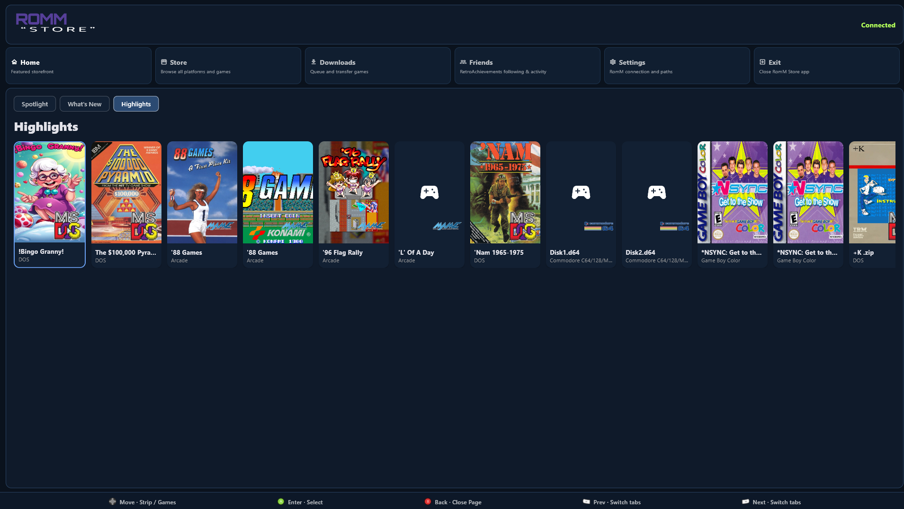
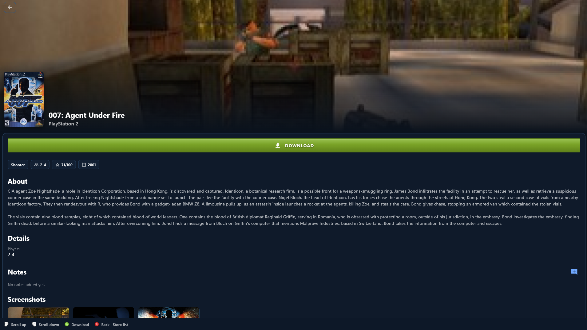

# RomM “Store”

> **Not a real store.** The name is a nod to the **Steam Store**—the UI took cues from **SteamOS** / Big Picture style. There is **no payment**, **no storefront**, and **no commerce**. This is a **RomM** client: a way to browse your self-hosted library and **download ROMs** to your machine. Think *RomM* **“store”** as in *your library presented like a storefront*, nothing for sale.

This repository is an **AI-edited fork** of **[Freegosy](https://github.com/abduznik/Freegosy)** (upstream), the Flutter client for **[RomM](https://github.com/rommapp/romm)**.

**What this fork is mainly for:** browsing your RomM library and **downloading ROMs** for use with **[EmuDeck](https://www.emudeck.com/)** or **[RetroDECK](https://retrodeck.net/)** (paths and layouts those tools expect). **Supported here:** **Linux** and **Windows**. Upstream Freegosy remains the broader, multi-platform RomM companion with fuller launcher features.


*Library view (layout may vary by version).*


*Game detail with download-focused actions.*

## Who this is for

- **EmuDeck** or **RetroDECK** users who run **RomM** and want a **desktop-style UI** to pull ROMs onto a Deck (or similar) where those stacks manage emulators and folders.
- **Windows** or **Linux** users who want the same download-focused RomM client.

## Features (this fork)

- **RomM**: connect, browse platforms and games (pagination and filters where the API allows).
- **Downloads**: HTTP downloads with progress; local paths aligned with EmuDeck / RetroDECK–style layouts where configured.
- **Shell UI**: home / library / downloads / settings navigation tuned for controller and keyboard.

## Building

```bash
flutter pub get
flutter build windows --release   # Windows
flutter build linux --release     # Linux
```

Windows output: `build/windows/x64/runner/Release/` (run `romm-store.exe` with the rest of that folder).

## Configuration

Set your RomM **base URL** and credentials in onboarding (same general model as upstream Freegosy). Download destinations follow the app’s directory settings so files land where you expect for EmuDeck / RetroDECK.

## About RomM

[RomM](https://github.com/rommapp/romm) is a self-hosted ROM manager. This app uses its API to list games and download files—it does not replace RomM on the server.

## Upstream and credits

- **Upstream:** [Freegosy](https://github.com/abduznik/Freegosy) (abduznik) — original cross-platform RomM Flutter app this fork is based on.
- **Lineage:** [Argosy](https://github.com/rommapp/argosy-launcher), [Wingosy](https://github.com/abduznik/Wingosy-Launcher).

**Sponsor the original upstream author:** [](https://github.com/sponsors/abduznik)

This fork may diverge from upstream; open issues here for fork-specific behavior.
